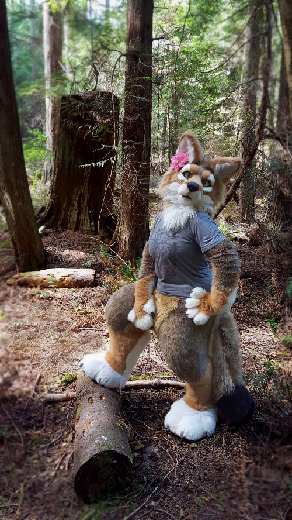

# Welcome to Matrices.net!


Matrices.net is the online home of Sara "Matrices" Howard, costume designer, tailor, artist, and dog-person extraordinare! I am interested in helping other people learn how to create and enhance their own costumes, I also offer sewing patterns for unique and useful costume parts and accessories.

I can't make all the things, so I have dedicated a significant amount of time and passion documenting and sharing my knowledge of my favorite crafts and projects here, so you can participate in creating your own! My goal in life is to foster creativity in all its forms, encouraging those who want to make things for themselves, while also assisting by providing printable patterns and tutorial content!

Take a look around, enjoy your time on my website! Maybe even learn a new thing or two! Happy crafting!

<--->


